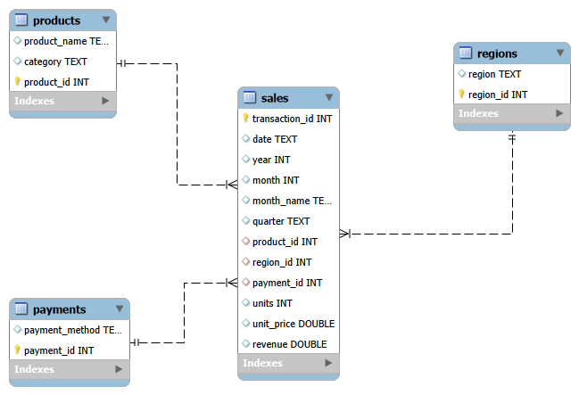

<h1 align="center">📊 Eficiência Comercial e Maximização de Margem Operacional no Varejo Digital</h1>

  <b>Pipeline completo de Business Intelligence</b> — da normalização de dados brutos em SQL até uma dashboard executiva interativa no Power BI.

  
  
  
  

---

  <a href="https://app.powerbi.com/view?r=eyJrIjoiYmU1ZTE0MzAtNDE0OS00ZmUyLWExMzktOWEzNTZjODVjNTc3IiwidCI6IjY1OWNlMmI4LTA3MTQtNDE5OC04YzM4LWRjOWI2MGFhYmI1NyJ9"><b>🔗 Acessar Dashboard Online</b></a>

## 🎥 Demonstração

https://github.com/user-attachments/assets/51502ec4-e74f-4ead-80f4-0dedcb1040b8

---

## 🧭 Sobre o Projeto

Este projeto transforma uma base de dados transacional bruta de um marketplace digital em uma solução completa de Business Intelligence, capaz de apoiar decisões estratégicas de negócio — indo da obtenção e diagnóstico dos dados até a entrega de uma dashboard interativa com insights acionáveis.

O fio condutor da análise é a **eficiência comercial e a maximização da margem operacional**: entender não apenas *quanto* a empresa vende, mas *onde*, *para quem* e com *que grau de concentração de risco* essas vendas acontecem.

**Dataset:** [Online Sales Dataset – Popular Marketplace Data (Kaggle)](https://www.kaggle.com/datasets/shreyanshverma27/online-sales-dataset-popular-marketplace-data) — 240 transações registradas entre janeiro e agosto de 2024.

📄 **[Relatório completo do projeto (PDF)](./Documentation/Eficiencia_Comercial_Margem_Operacional_Varejo_Digital.pdf)**

---

## 🎯 Perguntas de Negócio Respondidas

- Qual categoria de produto gera a maior receita para o negócio?
- Quais regiões apresentam o melhor desempenho comercial?
- Existe concentração de receita em alguma categoria ou região específica?
- Há sazonalidade perceptível no comportamento de vendas ao longo do ano?
- O preço unitário do produto influencia o volume de unidades vendidas?
- Existem oportunidades claras de expansão geográfica ou de categoria?
- Como o ticket médio pode ser aumentado?

---

## 🛠️ Stack Técnica

| Etapa | Ferramenta |
|---|---|
| Modelagem relacional e consultas analíticas | MySQL Workbench |
| Modelagem dimensional, DAX e visualização | Power BI |
| Arquitetura de dados | Star Schema (Modelo Estrela) |
| Análise exploratória | Python (pandas, matplotlib, seaborn) |

---

### Modelo Relacional (MySQL)

  

A tabela fato **sales** concentra as métricas transacionais (unidades, preço unitário, receita) e se conecta às três dimensões — **products**, **regions** e **payment_methods** — por meio de relacionamentos 1:N, já preparando a estrutura para o modelo estrela no Power BI.

---

## 📂 Estrutura do Repositório

- **Dashboard/** → Arquivo `.pbix` e demonstração em vídeo/GIF
- **Data/**
  - **cleaned_data/** → CSVs tratados (payments, products, regions, sales)
  - **modeling/** → Diagrama DER exportado do MySQL Workbench
- **Documentation/** → Relatório completo do projeto (PDF)
- **Scripts/sql/**
  - `01_star_schema_modeling.sql` → Criação das tabelas de dimensão e fato
  - `02_data_migration.sql` → Migração dos dados da tabela única para o modelo estrela
  - `03_category_analysis.sql` → Análises de receita e volume por categoria
  - `04_region_analysis.sql` → Análises de receita, volume e concentração por região
  - `05_payment_method_analysis.sql` → Distribuição por forma de pagamento
  - `06_statistical_analysis.sql` → Ticket médio, correlações e detecção de outliers
  - `07_abc_curve_analysis.sql` → Classificação ABC de produtos por receita acumulada

---

## 📊 A Dashboard

A dashboard foi estruturada em duas páginas complementares, com filtros interativos de **região** e **categoria** disponíveis em ambas.

### Página 1 — Visão Executiva
Panorama geral da saúde comercial: receita total, unidades vendidas, ticket médio, quantidade de pedidos e variação de receita entre janeiro e agosto, além de receita por região, por categoria e sua evolução mensal.

### Página 2 — Clientes e Mercado
Aprofundamento em comportamento de mercado, concentração de receita e relação preço x volume: região mais lucrativa, distribuição de unidades por região/categoria, forma de pagamento predominante e correlação entre preço e volume de vendas.

---

## 💡 Principais Insights

1. **Electronics domina o faturamento** — responsável por ~44% (US$ 3,1M) da receita total, mesmo sem liderar em volume de unidades.
2. **Forte concentração de receita** — América do Norte responde sozinha por 46,4% do faturamento, representando um risco estratégico de dependência regional.
3. **Oportunidade de expansão** — Ásia e Europa surgem como mercados a explorar para reduzir essa dependência.
4. **Volume ≠ Receita** — Clothing e Books lideram em unidades vendidas, mas é Electronics que concentra a maior receita.
5. **Potencial de cross-selling/upselling** — o alto volume de Clothing e Books pode ser usado como porta de entrada para elevar o ticket médio.
6. **Outliers identificados** — uma transação atípica de Clothing (~10 unidades) foi tratada estatisticamente via z-score para não distorcer as análises agregadas.
7. **Sazonalidade** — queda de -74% na receita entre janeiro e agosto, com leve recuperação em agosto, indicando necessidade de investigação adicional (campanhas, estoque, comportamento do consumidor).

---

## ▶️ Como Executar

1. Clone o repositório
2. Crie o banco no MySQL Workbench executando `01_star_schema_modeling.sql` (cria as tabelas de dimensão e fato)
3. Popule as tabelas escolhendo uma das opções abaixo:

- Opção A — usando os dados já tratados (mais rápido): importe diretamente os CSVs da pasta Data/cleaned_data/ (products.csv, regions.csv, payments.csv, sales.csv) para as tabelas correspondentes, usando o assistente de importação do MySQL Workbench. Nesse caso, não é necessário rodar  `02_data_migration.sql`.
- Opção B — partindo da tabela única original: caso você tenha os dados brutos em uma única tabela (vendas_tratada), execute 02_data_migration.sql para migrar e distribuir os dados entre as tabelas de dimensão e fato.

4. Execute as análises desejadas (`03` a `07`) conforme o tema de interesse
5. Abra o arquivo `.pbix` na pasta `Dashboard/` no Power BI Desktop

---

## 👥 Autoria

Projeto desenvolvido em grupo como parte do Bootcamp de Análise de Dados (Next Gen Tech):

- **Larissa Olimpio**
- Nivaldo Arruda
- Andreza Oliveira
- Jéssica Brenda

---

<i>Julho de 2026</i>

